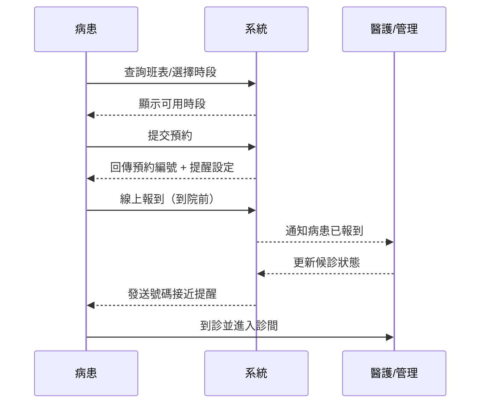
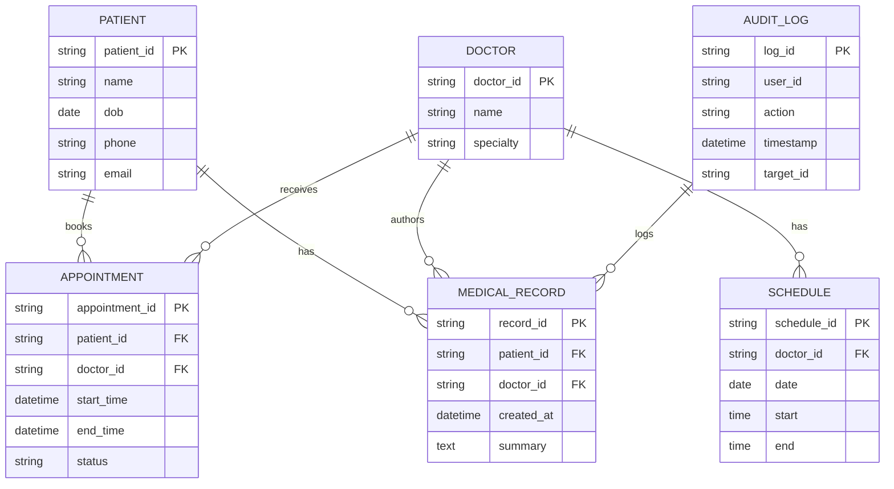
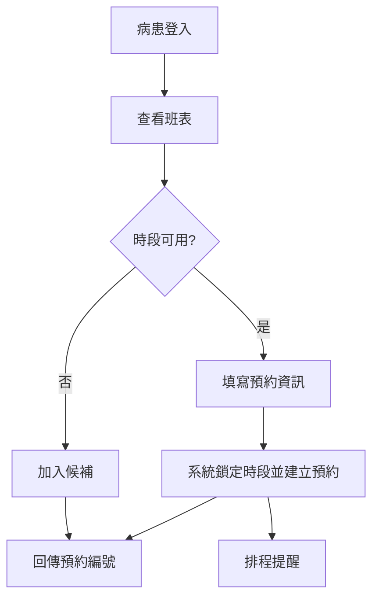
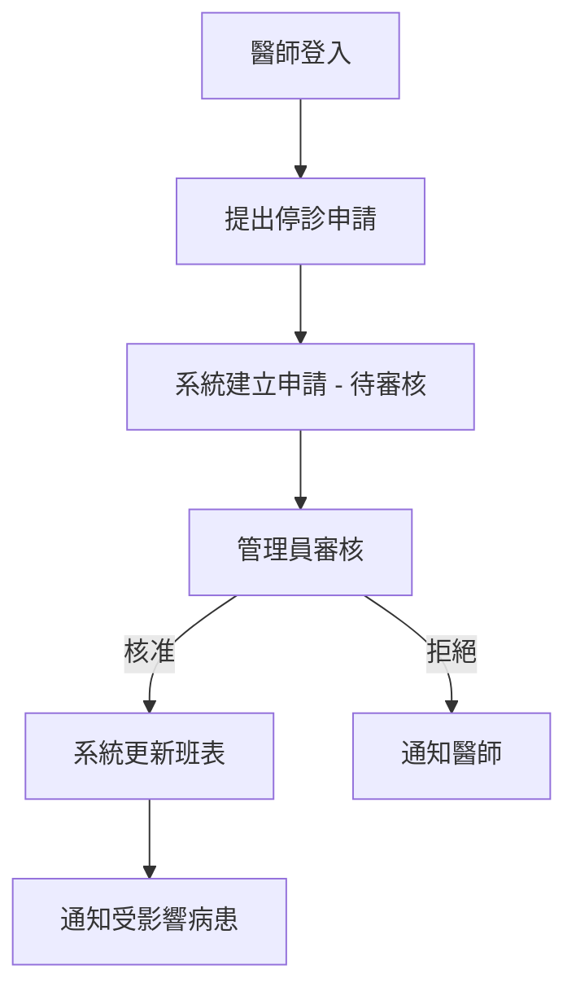

# Product Requirements Document (PRD) — 線上醫院掛號與診務系統

版本：0.2
作者：Product Manager
參考文件：`project-brief.md`, `prd-and-planning-draft.md`

---

## 目錄
1. 完整功能清單（模組與 Use Case 概覽）
下表遵循 Use Case 文件常見格式，為六大模組下的具體 Use Case（含 ID）彙整：
| 模組名稱 | 模組功能簡介 | Use Case ID / 名稱 | Use Case 功能簡介 |
|---|---|---|---|
| 使用者與身分管理 | 帳號註冊、登入、資料管理、權限 | UC-UM-01 註冊 | 病患可註冊帳號並驗證聯絡方式 |
| 使用者與身分管理 | 帳號註冊、登入、資料管理、權限 | UC-UM-02 登入/登出 | 病患/醫師/管理員登入登出系統 |
| 使用者與身分管理 | 帳號註冊、登入、資料管理、權限 | UC-UM-03 修改個人資料 | 使用者可更新聯絡資訊、偏好等 |
| 使用者與身分管理 | 帳號註冊、登入、資料管理、權限 | UC-UM-04 帳號管理（管理員） | 管理員建立/停用/修改帳號與角色 |
| 使用者與身分管理 | 帳號註冊、登入、資料管理、權限 | UC-UM-05 密碼重設 / MFA | 密碼重設與多因素驗證流程 |
| 門診與班表管理 | 班表維護、查詢、停診流程 | UC-SC-01 查詢班表 | 病患查詢科別/醫師班表與可約時段 |
| 門診與班表管理 | 班表維護、查詢、停診流程 | UC-SC-02 新增/修改班表 | 管理員新增或調整醫師班表 |
| 門診與班表管理 | 班表維護、查詢、停診流程 | UC-SC-03 刪除班表 | 管理員刪除不再使用的班表時段 |
| 門診與班表管理 | 班表維護、查詢、停診流程 | UC-SC-04 醫師停診申請 | 醫師提出停診，管理員審核並通知受影響病患 |
| 線上掛號與預約 | 預約建立、候補、提醒、懲罰 | UC-RS-01 建立預約 | 病患線上選時段掛號並取得預約編號 |
| 線上掛號與預約 | 預約建立、候補、提醒、懲罰 | UC-RS-02 修改預約 | 病患於截止時間內修改預約時段 |
| 線上掛號與預約 | 預約建立、候補、提醒、懲罰 | UC-RS-03 取消預約 | 病患於截止時間內取消預約並釋放名額 |
| 線上掛號與預約 | 預約建立、候補、提醒、懲罰 | UC-RS-04 候補管理 | 時段滿額時加入候補、候補升補通知 |
| 線上掛號與預約 | 預約建立、候補、提醒、懲罰 | UC-RS-05 過號/爽約懲罰 | 累積過號/爽約達門檻後限制線上報到 |
| 到診報到與候診排隊 | 線上/現場報到、候診號碼、過號處理 | UC-QM-01 線上報到 | 病患到院前線上報到並加入候診佇列 |
| 到診報到與候診排隊 | 線上/現場報到、候診號碼、過號處理 | UC-QM-02 Kiosk 報到 | 現場自助報到機／櫃台報到流程 |
| 到診報到與候診排隊 | 線上/現場報到、候診號碼、過號處理 | UC-QM-03 候診號碼顯示 | 實時顯示候診號碼與等候進度 |
| 病歷資料管理 | 病歷摘要查詢、醫師編輯、審計 | UC-EHR-01 病歷查詢（病患） | 病患查看就診摘要、檢驗報告（只讀） |
| 病歷資料管理 | 病歷摘要查詢、醫師編輯、審計 | UC-EHR-02 病歷查詢（醫師） | 醫師查看完整病歷與歷史記錄 |
| 病歷資料管理 | 病歷摘要查詢、醫師編輯、審計 | UC-EHR-03 病歷編輯 | 醫師新增/修改診療筆記，並寫入審計日誌 |
| 病歷資料管理 | 病歷摘要查詢、醫師編輯、審計 | UC-EHR-04 檔案上傳 | 上傳檢驗報告、影像連結並進行病毒掃描 |
| 病歷資料管理 | 病歷摘要查詢、醫師編輯、審計 | UC-EHR-05 審計日誌檢視 | 系統管理員搜尋/匯出操作日誌 |
| 診務通訊與管理儀表板 | 單向通知、內部通知、KPI 儀表板 | UC-CM-01 通知發送 | 系統發送報到/取消/號碼提醒（單向） |
| 診務通訊與管理儀表板 | 單向通知、內部通知、KPI 儀表板 | UC-CM-02 提醒排程管理 | 管理員設定提醒時程與模板 |
| 診務通訊與管理儀表板 | 單向通知、內部通知、KPI 儀表板 | UC-CM-03 儀表板 | 管理員查看即時門診流量、KPI 與警示 |
| 模組名稱 | 模組功能簡介 | Use Case | Use Case 功能簡介 |
|---|---|---|---|
| 使用者與身分管理 | 帳號註冊、登入、角色與權限管理 | 註冊/登入 | 病患/醫師/管理員帳號註冊與驗證 |
| 使用者與身分管理 | 帳號註冊、登入、角色與權限管理 | 帳號管理 | 管理員建立/停用/修改帳號 |
| 門診與班表管理 | 班表查詢、管理與停診流程 | 查詢班表 | 病患查詢醫師/科別班表 |
| 門診與班表管理 | 班表查詢、管理與停診流程 | 編輯班表 | 管理員新增/修改班表 |
| 門診與班表管理 | 班表查詢、管理與停診流程 | 醫師停診申請 | 醫師提出停診 → 管理員審核 |
| 線上掛號與預約 | 預約建立、候補、提醒 | 建立預約 | 病患線上選時段掛號 |
| 線上掛號與預約 | 預約建立、候補、提醒 | 候補管理 | 時段滿額時候補加入/移除 |
| 線上掛號與預約 | 預約建立、候補、提醒 | 過號/爽約懲罰 | 累積過號/爽約達門檻後限制在線上報到 |
| 到診報到與候診排隊 | 線上/現場報到、候診號碼、過號處理 | 線上報到 | 病患到院前完成報到 |
| 到診報到與候診排隊 | 線上/現場報到、候診號碼、過號處理 | Kiosk報到 | 現場自助報到機 |
| 病歷資料管理 | 病歷摘要查詢、醫師編輯、審計日誌 | 病歷查詢 | 病患/醫師查詢就診紀錄 |
| 病歷資料管理 | 病歷摘要查詢、醫師編輯、審計日誌 | 病歷編輯 | 醫師新增/修改診療筆記 |
| 診務通訊與管理儀表板 | 單向通知、內部通知、KPI 儀表板 | 通知發送 | 系統發送報到/取消/號碼提醒 |
| 診務通訊與管理儀表板 | 單向通知、內部通知、KPI 儀表板 | 儀表板 | 管理員查看即時門診流量 |

---

## 2. 範圍摘要（MVP 範圍）
- 含：六大核心模組（同上）
- 排除：急診特殊流程、遠距醫療/視訊診療、第三方線上付費/保險整合

---

## 3. 系統分析（圖表 — Mermaid 語法）

### 3.1 Use Case Diagram
```mermaid
%% Use Case Diagram for Online Hospital Registration System
actor Patient as 病患
actor Doctor as 醫師
actor Admin as 管理員

rectangle System {
  病患 -- (註冊/登入)
  病患 -- (查詢班表)
  病患 -- (線上掛號/預約)
  病患 -- (線上報到/Kiosk報到)
  病患 -- (查看病歷摘要)
  痑
  醫師 -- (登入)
  醫師 -- (查看班表)
  醫師 -- (停診申請)
  醫師 -- (編輯病歷)
  管理員 -- (管理班表)
  管理員 -- (管理帳號)
  管理員 -- (查看儀表板)
}
```

短述：此 Use Case 圖展示三種主要使用者（病患、醫師、管理員）與系統間的互動，涵蓋註冊、查詢班表、掛號、報到、病歷存取與管理後台功能。

### 3.2 Swimlane Diagram（病患線上掛號到到診報到的完整流程）


短述：此泳道（Swimlane）序列圖描述病患從班表查詢、預約、線上報到到收到就診提醒的端到端流程，並標示系統與醫護端之間的通訊點。

### 3.3 ERD（核心實體關係圖）


短述：ERD 定義了病患、醫師、班表、預約、病歷與審計日誌的主要實體與關聯，用以支援預約與病歷操作的資料模型基礎。

---

## 4. Epics 與 User Stories（完整整合）
以下為整合後的所有 Epics 與 User Stories，包含完整的驗收標準（Acceptance Criteria）。

---

#### Epic A — 使用者與身分管理（User Management）
描述：建立統一的身份驗證與授權服務，支援病患、醫師、管理員角色與權限管理。

User Story A1
- 描述：作為一名病患，我希望能在線上註冊帳號並填寫聯絡資訊，以便完成預約與接收通知。
- 驗收標準：
  - 病患可以使用電子郵件或手機號碼註冊帳號並完成電子郵件/手機驗證。
  - 註冊流程包含必填欄位：姓名、生日、聯絡電話、電子郵件、健保卡號（可用模擬值）。
  - 註冊完成後自動建立病患檔案並能即時用於預約流程（新建立的帳號在 5 分鐘內能呼叫預約 API）。

User Story A2
- 描述：作為一名醫師，我希望能使用醫院提供的帳號登入系統，以便查看個人班表與病患報到狀態。
- 驗收標準：
  - 醫師可透過 SSO（若醫院提供）或系統帳號登入，登入成功率 >= 99%（非網路中斷情況）。
  - 登入後 3 秒內顯示今日班表與當下候診名單（在測試資料環境）。

User Story A3
- 描述：作為管理員，我希望能建立與管理不同角色帳號，以控管系統存取權限。
- 驗收標準：
  - 管理員可新增/停用/修改帳號角色（病患/醫師/管理員）。
  - 該操作需被記錄到審計日誌，包含操作者 ID、時間戳與變更摘要。

User Story A4 (安全)
- 描述：作為系統管理者，我希望系統支援密碼重設與多因素驗證（可選），以提高帳號安全。
- 驗收標準：
  - 使用者可發起密碼重設流程並透過驗證碼完成重設。
  - 系統可啟用 OTP 類型的多因素驗證；啟用後登入需額外通過 MFA。

---

#### Epic B — 門診與班表管理（Clinic & Schedule Management）
描述：提供班表 CRUD、班表查詢，以及醫師停診申請與管理員核准流程。

User Story B1
- 描述：作為病患，我要能查詢某科別或特定醫師的班表，以方便選擇時段預約。
- 驗收標準：
  - 病患可依科別、醫師名稱或日期篩選班表。
  - 查詢結果在 2 秒內返回（在正常負載下）。

User Story B2
- 描述：作為醫師，我要能提交『停診申請』並附上停診原因，以便管理員處理並自動通知受影響病患。
- 驗收標準：
  - 醫師可為未來日期提出停診申請，需包含停診時段、原因與備註。
  - 管理員在介面能看到待審核的停診申請並能核准或拒絕，核准後系統自動更新班表並發送通知給受影響的預約者。

User Story B3
- 描述：作為管理員，我希望能快速新增或調整臨時班次以應對流量變化。
- 驗收標準：
  - 管理員在 5 分鐘內能新增臨時班次並同步至病患查詢介面。
  - 新增/修改班次的操作會被記錄於審計日誌。

---

#### Epic C — 線上掛號與預約（Registration & Scheduling）
描述：病患線上查看時段、掛號、候補與提醒流程；不含先付款。

User Story C1
- 描述：作為病患，我希望能在行動裝置上選擇科別、醫師和時段完成掛號。
- 驗收標準：
  - 病患可選擇科別/醫師/時段並提交預約申請，系統回傳預約編號。
  - 若時段已滿，病患可加入候補清單並收到候補成功通知。

User Story C2
- 描述：作為病患，我希望在預約前收到可視化的時段可用性（即時），以做出選擇。
- 驗收標準：
  - 顯示的時段可用性為系統實際狀態（在 5 秒內更新）。
  - 系統在建立預約時對時段做最終鎖定，避免雙重預約。

User Story C3
- 描述：作為管理員，我希望設定自動提醒規則（例如提前 48h、24h、2h），以降低爽約率。
- 驗收標準：
  - 可配置的提醒模板可選擇透過 SMS/Email/推播發送，模板支援簡短與詳細兩種格式。
  - 系統紀錄每次提醒發送結果（送達/失敗）。

User Story C4 (過號/爽約懲罰)
- 描述：作為系統，我需要監控並記錄病患的過號/爽約次數，當某病患在 90 天內累積 >=3 次過號/爽約後，自動限制其只能改為現場 Kiosk 報到（禁止線上報到），以提升整體遵從率。
- 驗收標準：
  - 系統能記錄每次預約的狀態（完成/到診/過號/爽約），並能在病患層級計算過號/爽約次數（可設定時間窗口，預設 90 天）。
  - 當病患在設定窗口內累計過號/爽約達到門檻（預設 3 次）時，系統會：
    1. 將該病患的帳號標記為「限制線上報到」狀態（不可於線上完成報到）。
    2. 在病患嘗試線上報到時顯示明確資訊（含剩餘限制天數與申訴流程連結）。
    3. 自動發送通知（Email/SMS/推播）告知病患被限制線上報到及解鎖條件。
  - 管理員介面可查詢被限制的病患名單，並能手動解除限制（操作需記錄於審計日誌）。

---

#### Epic D — 到診報到與候診排隊（Check-in & Queue Management）
描述：支援線上報到、Kiosk 報到、實時排隊與過號處理（簡化急診情境）。

User Story D1
- 描述：作為病患，我希望能在線上或 Kiosk 完成報到，避免現場排長龍。
- 驗收標準：
  - 病患可於預約時段前線上報到，系統在報到後更新候診名單並通知對應診間。
  - 報到流程在 30 秒以內完成（含網路延遲）。

User Story D2
- 描述：作為病患，我希望在號碼即將到達時收到提醒，以便提早準備進診間。
- 驗收標準：
  - 系統於號碼前兩名時發送單向提醒給病患（SMS/推播），並記錄發送結果。

User Story D3
- 描述：作為管理員，我希望系統能自動處理過號情況（例如重新候補或自動取消並通知病患），以維持候診秩序。
- 驗收標準：
  - 系統能依預設規則判定過號並執行指定動作（重新候補或取消），並發送通知。
  - 任何過號導致的狀態變更都有審計紀錄。

---

#### Epic E — 病歷資料管理（Electronic Health Record Management）
描述：提供病歷的查詢與（受控的）醫師編輯能力，強調資料完整性、審計日誌與嚴格的存取權限控制。

User Story E1
- 描述：作為病患，我希望能查看並下載我的就診摘要與檢驗報告，以便自主管理健康紀錄。
- 驗收標準：
  - 病患可在個人介面查看最近 N 次就診摘要與檢驗報告（N 由醫院設定，預設 12 個月）。
  - 病患可下載 PDF 格式的就診摘要，但無法修改病歷內容。

User Story E2
- 描述：作為醫師，我希望能新增診療筆記與上傳檢驗報告，以記錄臨床決策並供後續查詢。
- 驗收標準：
  - 醫師可新增或修改診療筆記，所有變更需包含操作者 ID 與時間戳，並被寫入不可變更的審計日誌中。
  - 上傳檔案需通過病毒掃描與格式檢查，成功上傳後能在病患查詢介面顯示連結（依存取權限）。

User Story E3
- 描述：作為系統管理員，我希望有可搜尋的審計日誌，能回溯誰在何時對哪筆病歷做了什麼操作，以配合法務或稽核需求。
- 驗收標準：
  - 審計日誌包含：操作者 ID、操作類型（新增/修改/刪除/檢視）、目標病歷 ID、時間戳、來源 IP/裝置識別（若可得）。
  - 日誌不可被系統使用者刪除，並支援匯出（CSV/JSON）以便法務或稽核使用。

User Story E4 (存取控管)
- 描述：作為資安負責人，我希望系統能支援基於角色的存取控管（RBAC）並細分敏感欄位的讀寫權限，以符合法規。
- 驗收標準：
  - 系統支援角色與權限矩陣：醫師可讀寫其負責病患之完整病歷；行政僅能讀取非敏感欄位（如聯絡資訊）；病患僅能讀取摘要。
  - 任一嘗試未授權存取的行為會被阻擋並寫入審計日誌，且管理員可在 1 小時內收到異常警示（若設定）。

---

#### Epic F — 診務通訊與管理儀表板（Communication & Admin Dashboard）
描述：實作院內單向通知機制與運營儀表板，用以支援醫護與管理決策。

User Story F1
- 描述：作為管理員，我希望在儀表板上看到即時門診流量與各診間負載，以便快速調配人力。
- 驗收標準：
  - 儀表板在 5 秒內更新當前候診人數與診間負載（在正常資料流下）。

User Story F2
- 描述：作為醫護人員，我希望在病患到診或取消時收到系統通知，以便調整門診安排。
- 驗收標準：
  - 病患報到或取消事件會在 30 秒內觸發內部通知至相關醫護端，並記錄送達結果。

User Story F3
- 描述：作為病患，我希望在我的看診號碼接近時收到單向提醒，以便準備就診。
- 驗收標準：
  - 在號碼前兩名時發送單向提醒到病患，並記錄送達狀態；若送達失敗，系統保留重新嘗試策略或告知管理員手動處理。

---

## 5. Use Case 詳細文字敘述與 Activity Diagram

### Use Case：病患新增掛號（Patient Creates Appointment）
- 主要參與者：病患、系統、醫院資料介面
- 前置條件：病患已註冊並登入，醫師班表已上傳至系統
- 主要流程：
  1. 病患登入系統並進入「掛號」頁面。
  2. 病患選擇欲看診的科別與醫師，系統顯示該醫師的可用時段。
  3. 病患選擇時段並填寫必要就診資訊（如主訴），提交預約請求。
  4. 系統檢查時段可用性並鎖定時段，建立預約記錄，回傳預約編號。
  5. 系統依預設提醒策略排程提醒（48h、24h、2h）並在必要時發送確認通知。
  6. 若時段已滿或衝突，系統提示病患加入候補清單。
  7. 流程完成。

#### Activity Diagram（Mermaid）


### Use Case：醫師停診申請（Doctor Requests Leave）
- 主要參與者：醫師、系統、管理員、病患（可能受影響）
- 前置條件：醫師已登入系統並查看個人班表
- 主要流程：
  1. 醫師於系統中選擇欲停診的日期/時段並填寫停診原因。
  2. 系統建立停診申請並將申請狀態設為「待審核」。
  3. 管理員在後台接收申請，審核後核准或拒絕。
  4. 若核准，系統自動更新班表，將受影響的預約標記為需重排，並通知受影響之病患（Email/SMS）。
  5. 流程完成。

#### Activity Diagram（Mermaid）


---

## 6. 非功能性需求（NFRs）
（同先前定義，包含 Performance, Security & Compliance, Availability 等）

---

## 7. 給 Architect 的下一步指示
1. 基於 ERD 與 Use Case，產出 Class Diagram 與 Sequence Diagram（特別針對「建立預約」、「醫師停診核准」、「過號限制生效」三個場景）。
2. 定義 API 合約（包含錯誤碼與認證流程）。
3. 設計審計日誌存放結構與保留策略（WORM 或寫入安全 Storage）。

---

文件：`prd.md` 完成，作為「文件 B」交付。
