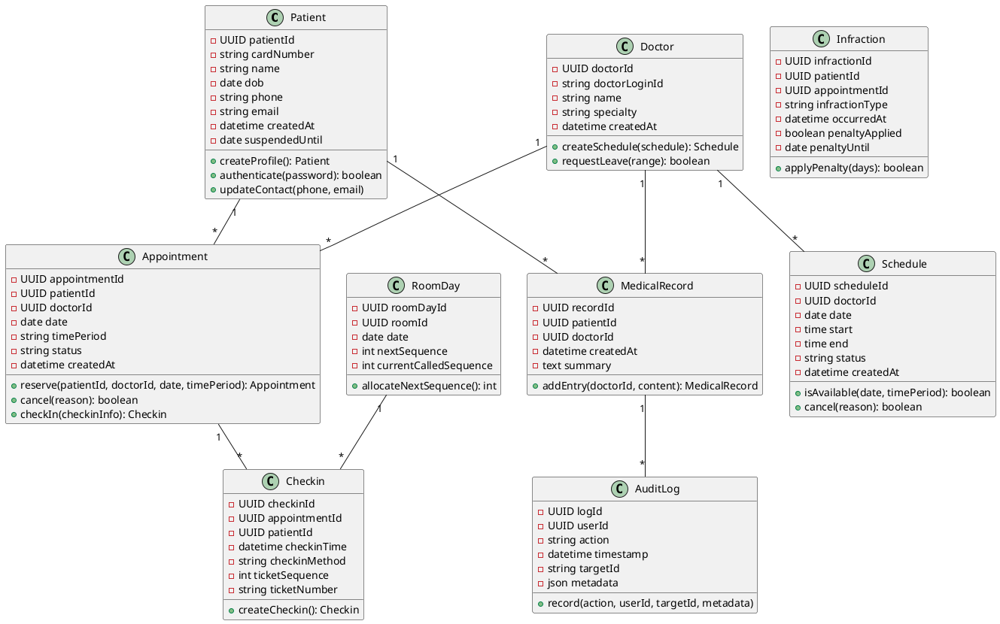
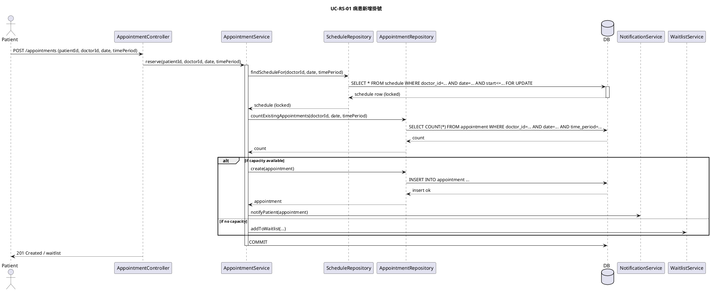
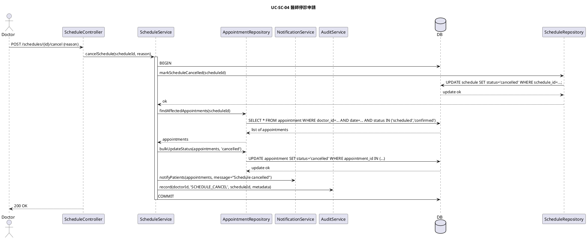
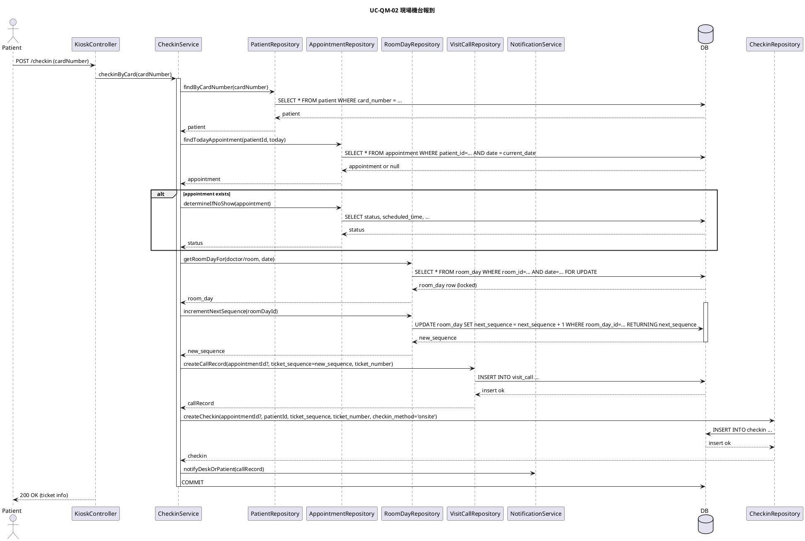

## 線上醫院掛號與診務系統 — 軟體設計文件 (SDD)

版本: 1.0

最後更新: 2025-10-31

作者: 系統架構師 (Architect Agent)

概要
----
本文件為「線上醫院掛號與診務系統」之軟體設計文件 (SDD)。內容涵蓋資料庫物理設計、類別圖 (Class Diagram)、與三個主要業務流程之循序圖 (Sequence Diagram)。PlantUML 程式碼包含於文件中，便於直接產圖或納入設計檔案管理。

目錄
----
- 系統概覽
- 資料庫物理設計
  - 關聯性說明
  - 資料表與欄位定義（DDL 範例 / 索引建議）
  - 屬性語意與安全/索引建議
  - 交易、鎖定與一致性策略
- 物件設計：類別圖 (PlantUML)
- 物件交互：循序圖 (PlantUML)
  - UC-RS-01 病患新增掛號
  - UC-SC-04 醫師停診申請
  - UC-QM-02 現場機台報到
- 附錄：範例 SQL (Postgres)

## 系統概覽
此系統提供病患線上/線下掛號、報到管理、醫師班表管理、病歷紀錄與稽核等主要功能。系統架構採分層設計：Controller -> Service -> Repository -> Database，並以 Notification Service、Audit Service 等周邊服務支援非同步通知與審計。

## 資料庫物理設計

### 關聯性說明
列出 ERD 中的主要關聯性、基數與商業邏輯理由：

- PATIENT (1) ──< APPOINTMENT (多)
  - 基數：一位病患可有多個預約；一筆預約屬於一位病患（1 對多）。
  - 商業邏輯：病患會在不同時間為不同門診或不同醫師建立多筆預約，系統需能追蹤歷史與未來預約。

- DOCTOR (1) ──< APPOINTMENT (多)
  - 基數：一位醫師可被多筆預約指向；一筆預約對應到一位醫師（1 對多）。
  - 商業邏輯：每個醫師會接收多名病患的預約，需用以調度與候診管理。

- DOCTOR (1) ──< SCHEDULE (多)
  - 基數：一位醫師可有多個班表時段記錄（1 對多）。
  - 商業邏輯：醫師會有多個班次（不同日期/時段），班表表決定可供預約的時段。

- PATIENT (1) ──< MEDICAL_RECORD (多)
  - 基數：一位病患可擁有多筆病歷紀錄（1 對多）。
  - 商業邏輯：病歷以就診事件為單位，每次就診或新增診療都會形成一筆病歷。

- DOCTOR (1) ──< MEDICAL_RECORD (多)
  - 基數：一位醫師可為多筆病歷負責或建立（1 對多）。
  - 商業邏輯：醫師會為多名病患建立/更新病歷，需在病歷中記錄作者資訊以利追溯。

- MEDICAL_RECORD (1) ──< AUDIT_LOG (多)
  - 基數：每筆病歷的操作會產生多筆審計日誌（1 對多）。
  - 商業邏輯：所有病歷的新增/修改/刪除/檢視等敏感操作必須寫入不可變更的審計日誌，以符合法規與稽核要求。

備註：上述關聯以資料庫外鍵（FK）方式實作，且在應用層需以交易（transaction）與鎖定機制（例如在建立預約時鎖定時段）來確保資料一致性與預約競爭控制。

### 資料表與欄位定義（Table & Attribute Definition）
以下為各實體表格與欄位定義（依據 PM 階段確認之詳細規格整合），包含 PK/FK、NOT NULL 與備註。資料型別以 PostgreSQL 為範例；實際可依 DBMS 做微調。

#### PATIENT
| 屬性 | 資料型別 (範例) | PK/FK | NOT NULL | 備註 |
|---|---|:---:|:---:|---|
| patient_id | UUID / UUID | PK | Yes | 病患主鍵（內部識別） |
| card_number | VARCHAR(64) | UNIQUE | Yes (建議) | 虛擬健保卡號，用於報到與身份核對 |
| name | VARCHAR(255) |  | Yes | 病患姓名 |
| password_hash | VARCHAR(512) |  | Yes | 加密後的密碼（用於登入驗證） |
| dob | DATE |  | Yes | 出生日期 |
| phone | VARCHAR(32) |  | Yes | 聯絡電話（註冊時必填） |
| email | VARCHAR(255) |  | Yes | 電子郵件（註冊時必填） |
| created_at | TIMESTAMP WITH TIME ZONE |  | Yes | 建檔時間 |
| suspended_until | DATE |  | No | 若為未來日期，則禁止線上報到；由系統自動套用過號懲罰時寫入 |

#### DOCTOR
| 屬性 | 資料型別 (範例) | PK/FK | NOT NULL | 備註 |
|---|---|:---:|:---:|---|
| doctor_id | UUID | PK | Yes | 醫師主鍵 |
| doctor_login_id | VARCHAR(128) | UNIQUE | Yes | 系統生成之唯一登入識別 |
| password_hash | VARCHAR(512) |  | Yes | 加密後的密碼 |
| name | VARCHAR(255) |  | Yes | 醫師姓名 |
| specialty | VARCHAR(128) |  | Yes | 專科/科別 |
| created_at | TIMESTAMP WITH TIME ZONE |  | Yes | 建檔時間 |

#### ADMIN
| 屬性 | 資料型別 (範例) | PK/FK | NOT NULL | 備註 |
|---|---|:---:|:---:|---|
| admin_id | UUID | PK | Yes | 管理員主鍵 |
| name | VARCHAR(255) |  | Yes | 管理員姓名 |
| email | VARCHAR(255) |  | Yes | 管理員電子郵件（登入帳號 / 聯絡用） |
| account_username | VARCHAR(128) | UNIQUE | Yes | 管理員登入帳號 |
| password_hash | VARCHAR(512) |  | Yes | 加密後的密碼 |
| is_system_account | BOOLEAN |  | Yes | 系統自動建立帳號標記 |
| created_at | TIMESTAMP WITH TIME ZONE |  | Yes | 建檔時間 |

#### APPOINTMENT
| 屬性 | 資料型別 (範例) | PK/FK | NOT NULL | 備註 |
|---|---|:---:|:---:|---|
| appointment_id | UUID | PK | Yes | 預約主鍵 |
| patient_id | UUID | FK -> PATIENT.patient_id | Yes | 關聯病患 |
| doctor_id | UUID | FK -> DOCTOR.doctor_id | Yes | 關聯醫師 |
| date | DATE |  | Yes | 預約日期 |
| time_period | VARCHAR(32) |  | Yes | 預約時段 (morning/afternoon/evening) |
| status | VARCHAR(32) (enum) |  | Yes | 預約狀態（scheduled/confirmed/waitlist/cancelled/checked_in/waiting/called/in_consult/completed/no_show） |
| created_at | TIMESTAMP WITH TIME ZONE |  | Yes | 建立時間 |

#### CHECKIN
| 屬性 | 資料型別 (範例) | PK/FK | NOT NULL | 備註 |
|---|---|:---:|:---:|---|
| checkin_id | UUID | PK | Yes | 報到記錄主鍵 |
| appointment_id | UUID | FK -> APPOINTMENT.appointment_id | No | 若有預約則關聯 |
| patient_id | UUID | FK -> PATIENT.patient_id | Yes | 病患 |
| checkin_time | TIMESTAMP WITH TIME ZONE |  | No | 病患實際報到時間（線上或現場） |
| checkin_method | VARCHAR(16) |  | No | 報到方式（onsite / online） |
| ticket_sequence | INTEGER |  | No | 該診間/該醫師當日之流水序號（每日 00:00 重置） |
| ticket_number | VARCHAR(64) |  | No | 顯示用號碼 |
| cancelled_by | UUID | FK -> ADMIN.admin_id | No | 若為院方或管理員取消，記錄操作者 |
| cancel_reason | TEXT |  | No | 取消原因或備註 |

#### SCHEDULE
| 屬性 | 資料型別 (範例) | PK/FK | NOT NULL | 備註 |
|---|---|:---:|:---:|---|
| schedule_id | UUID | PK | Yes | 班表記錄主鍵 |
| doctor_id | UUID | FK -> DOCTOR.doctor_id | Yes | 所屬醫師 |
| date | DATE |  | Yes | 班表日期 |
| start | TIME |  | Yes | 班表開始時間 |
| end | TIME |  | Yes | 班表結束時間 |
| status | VARCHAR(32) |  | Yes | 班表狀態（active/cancelled/closed） |
| created_at | TIMESTAMP WITH TIME ZONE |  | Yes | 建檔時間 |

#### MEDICAL_RECORD
| 屬性 | 資料型別 (範例) | PK/FK | NOT NULL | 備註 |
|---|---|:---:|:---:|---|
| record_id | UUID | PK | Yes | 病歷主鍵 |
| patient_id | UUID | FK -> PATIENT.patient_id | Yes | 關聯病患 |
| doctor_id | UUID | FK -> DOCTOR.doctor_id | Yes | 建立或負責之醫師 |
| created_at | TIMESTAMP WITH TIME ZONE |  | Yes | 建檔時間 |
| summary | TEXT |  | No | 病歷摘要或內容 |

#### AUDIT_LOG
| 屬性 | 資料型別 (範例) | PK/FK | NOT NULL | 備註 |
|---|---|:---:|:---:|---|
| log_id | UUID | PK | Yes | 審計日誌主鍵 |
| user_id | UUID |  | Yes | 執行者（系統或使用者 ID） |
| action | VARCHAR(64) |  | Yes | 操作類型（CREATE/UPDATE/DELETE/VIEW） |
| timestamp | TIMESTAMP WITH TIME ZONE |  | Yes | 操作時間 |
| target_id | VARCHAR(128) |  | No | 被操作之資源 ID（例如 record_id / appointment_id） |
| metadata | JSONB |  | No | 建議儲存變更前後摘要、IP、user-agent 等資訊 |

#### VisitCall (叫號歷史 / CallHistory)
| 屬性 | 資料型別 (範例) | PK/FK | NOT NULL | 備註 |
|---|---|:---:|:---:|---|
| call_id | UUID | PK | Yes | 叫號記錄主鍵 |
| appointment_id | UUID | FK -> APPOINTMENT.appointment_id | No | 被叫的預約（若為臨時號或無預約則可為 null） |
| ticket_sequence | INTEGER |  | Yes | 被叫之序號 |
| ticket_number | VARCHAR(64) |  | No | 顯示用號碼 |
| called_at | TIMESTAMP WITH TIME ZONE |  | Yes | 叫號時間 |
| called_by | UUID | FK -> ADMIN.admin_id | No | 執行叫號的人員 |
| call_type | VARCHAR(16) |  | Yes | call / recall / skip |
| call_status | VARCHAR(16) |  | Yes | active / expired / attended |

#### Infraction (過號 / 爽約紀錄)
| 屬性 | 資料型別 (範例) | PK/FK | NOT NULL | 備註 |
|---|---|:---:|:---:|---|
| infraction_id | UUID | PK | Yes | 違規記錄主鍵 |
| patient_id | UUID | FK -> PATIENT.patient_id | Yes | 關聯病患 |
| appointment_id | UUID | FK -> APPOINTMENT.appointment_id | No | 關聯的預約（若有） |
| infraction_type | VARCHAR(32) |  | Yes | no_show / late_cancel / other |
| occurred_at | TIMESTAMP WITH TIME ZONE |  | Yes | 事件發生時間 |
| penalty_applied | BOOLEAN |  | Yes | 是否已套用懲罰 |
| penalty_until | DATE |  | No | 若套用懲罰則到期日（例如 suspended_until） |
| notes | TEXT |  | No | 備註 |

#### RoomDay / DayCounter (每日診間序號管理)
| 屬性 | 資料型別 | PK/FK | NOT NULL | 備註 |
|---|---|:---:|:---:|---|
| room_day_id | UUID | PK | Yes | 主鍵 |
| room_id | UUID |  | Yes | 診間或醫師/診別識別 |
| date | DATE |  | Yes | 該日（每日 00:00 依 date 區隔） |
| next_sequence | INTEGER |  | Yes | 下一個要發的序號（transaction-safe update） |
| current_called_sequence | INTEGER |  | No | 可選：當前已叫到之序號 |

註：RoomDay 以 (room_id, date) 為唯一鍵；在 checkin 時使用 SELECT ... FOR UPDATE 以安全遞增 next_sequence，保證當日序號不重複，且每日基於 date 自然重置。

### 屬性用途與意義 (Attribute Semantics)
以下以中文說明每個屬性的用途與注意事項，包含安全性、驗證、索引與保護建議（已整合自 PM 階段資料）：

- PATIENT.patient_id (UUID)
  - 意義/用途：病患主鍵（內部辨識用），用於資料關聯與 API 傳遞。不可外露原始 UUID 至公開日誌。建議為 NOT NULL。

- PATIENT.card_number (虛擬健保卡號，string)
  - 意義/用途：病患的虛擬健保卡號，用於身份快速比對與現場報到（Kiosk）時的身份識別。此欄位：
    1. 在病患註冊時為必填（但可接受模擬值以支援測試環境）；
    2. 在報到流程（UC-QM-02 等）中作為核對欄位，Kiosk 或櫃檯可使用此值來快速定位預約紀錄；
    3. 應該是唯一索引（UNIQUE），以利快速查詢與避免重複。若某些情況允許重複（例如不同地區編碼策略），請在設計時明確化唯一性範圍。
  - 安全性/合規建議：此欄位屬於身份識別資訊（PII），儲存時建議以可逆加密或保護欄位方式儲存（例如使用金鑰管理的 AES-256 加密，並在應用層進行最小權限解密）。在 UI 中展示時應遮蔽部分位元（例如顯示後 4 碼），並確保審計日誌記錄該欄位的存取事件。

- PATIENT.name / dob / phone / email
  - 意義/用途：病患的基本個人資料，用於聯絡、通知與身分辨識。phone/email 作為通知渠道；dob 用於年齡/身分驗證或臨床決策。
  - 安全性：有關個人識別資訊應納入存取控管（RBAC）與審計機制；依法規決定是否需要加密或部分遮蔽。

- DOCTOR.doctor_id / name / specialty
  - 意義/用途：醫師主鍵與基本資訊，用以排班與配置診間。specialty 用於患者篩選與班表查詢。

- APPOINTMENT.* 欄位
  - 意義/用途：預約的時段、關聯病患/醫師、狀態（confirmed/waitlist/cancelled/no-show）和建立時間。status 為系統流程控制核心欄位，需與提醒通知排程、候補邏輯與過號處理相結合。

- SCHEDULE.* 欄位
  - 意義/用途：醫師的班表時段定義，系統以 schedule 產生可供預約的時段或作為班表 CRUD 的來源。

- MEDICAL_RECORD.* 欄位
  - 意義/用途：病歷紀錄（診療摘要、檢驗結果引用等）。應依存取權限做細分存取控制，且所有變更須寫入審計日誌。

- AUDIT_LOG.* 欄位
  - 意義/用途：記錄系統內敏感操作（誰在何時對哪個資源做了什麼），必須為不可變更（append-only）且能匯出供稽核。建議寫入時包含操作者 IP、user-agent、變更前後摘要（若適用）。

### 索引與查詢建議
- 對於經常以 patient_id、card_number、doctor_id、date、status 查詢的欄位，建議建立 B-tree 索引。
- 對於 JSONB metadata 的查詢，建議建立 GIN 索引。
- APPOINTMENT(date, doctor_id, status) 可建立複合索引以加速班表與候診查詢。
- RoomDay(room_id, date) 應建立唯一約束與索引，以利 SELECT ... FOR UPDATE 的快速定位。

### 交易、鎖定與一致性策略
- 建議在建立預約 (UC-RS-01) 與發放當日序號 (RoomDay.next_sequence) 的流程中，使用資料庫層級交易 (BEGIN ... COMMIT) 並搭配行鎖（例如 Postgres 的 SELECT ... FOR UPDATE）以避免並發超額掛號或序號重複。
- 所有跨多表的寫入（例如取消班表需同時變更 SCHEDULE 與相關 APPOINTMENT）應在單一交易內完成，若操作耗時長則採用悲觀鎖或在應用層加上重試/補償機制。
- AUDIT_LOG 採 append-only；建議在同一交易或在完成主要寫入後立即以獨立連線寫入審計，且不要允許被覆寫或刪除。

## 物件設計 — 類別圖 (Class Diagram)
下列為核心資料實體之類別圖 (PlantUML)。類別包含主要屬性與常用方法 (service-oriented 方法為示意，實際實作於 Service 層)。



## 物件交互設計 — 循序圖 (Sequence Diagrams)
以下提供三個關鍵業務流程的 PlantUML 程式碼，描繪 Controller、Service、Repository 與 Database 之間的互動；同時標示交易與鎖定點。

### UC-RS-01 病患新增掛號（Reserve Appointment）
重點：檢查班表空檔、使用行鎖 Locking (SELECT ... FOR UPDATE) 以避免超額掛號，並在交易中寫入 APPOINTMENT。



說明要點：
- ScheduleRepository 使用 SELECT ... FOR UPDATE 在 transaction 中鎖定該班次或 room_day，以避免同一時段之多個並發建立導致超賣。
- transaction 範圍包括檢查與建立 APPOINTMENT、可能的 RoomDay.next_sequence 更新（若同步發序號）。

### UC-SC-04 醫師停診申請（Doctor Cancel Schedule / Apply Leave）
重點：醫師申請停診後系統更新 SCHEDULE，識別受影響的 APPOINTMENT，並觸發 Notification Service。



說明要點：
- 取消班表為跨多表操作，必須在交易中（或採可靠補償機制）完成更新與通知安排，避免出現部分更新。
- NotificationService 可為非同步處理（例如發送 email / sms / push），但排程應有 retry 與 dead-letter 機制。

### UC-QM-02 現場機台報到（Kiosk Check-in）
重點：病患輸入卡號，系統判斷是否過號、計算插隊序號（當前叫號後第三個位置），並更新 CHECKIN 與佇列狀態。



說明要點：
- RoomDayRepository 使用 SELECT ... FOR UPDATE 鎖定當日房間序號並原子性地遞增 next_sequence，確保序號不重複。
- 判定是否為過號 (no-show) 依據 appointment.status 與 scheduled_time 與當前時間的比較。若為過號，則建立 Infraction 並視情況套用 penalty（suspended_until）。

## 附錄：範例 SQL (Postgres)
以下為核心表格之範例 DDL（Postgres 範例）；實際部署可依 DBMS 調整型別與索引語法。

```sql
CREATE EXTENSION IF NOT EXISTS "uuid-ossp";

CREATE TABLE patient (
  patient_id UUID PRIMARY KEY DEFAULT uuid_generate_v4(),
  card_number VARCHAR(64) UNIQUE NOT NULL,
  name VARCHAR(255) NOT NULL,
  password_hash VARCHAR(512) NOT NULL,
  dob DATE NOT NULL,
  phone VARCHAR(32) NOT NULL,
  email VARCHAR(255) NOT NULL,
  created_at TIMESTAMP WITH TIME ZONE DEFAULT now() NOT NULL,
  suspended_until DATE
);

CREATE TABLE doctor (
  doctor_id UUID PRIMARY KEY DEFAULT uuid_generate_v4(),
  doctor_login_id VARCHAR(128) UNIQUE NOT NULL,
  password_hash VARCHAR(512) NOT NULL,
  name VARCHAR(255) NOT NULL,
  specialty VARCHAR(128) NOT NULL,
  created_at TIMESTAMP WITH TIME ZONE DEFAULT now() NOT NULL
);

CREATE TABLE schedule (
  schedule_id UUID PRIMARY KEY DEFAULT uuid_generate_v4(),
  doctor_id UUID NOT NULL REFERENCES doctor(doctor_id),
  date DATE NOT NULL,
  start TIME NOT NULL,
  "end" TIME NOT NULL,
  status VARCHAR(32) NOT NULL DEFAULT 'active',
  created_at TIMESTAMP WITH TIME ZONE DEFAULT now() NOT NULL
);

CREATE TABLE appointment (
  appointment_id UUID PRIMARY KEY DEFAULT uuid_generate_v4(),
  patient_id UUID NOT NULL REFERENCES patient(patient_id),
  doctor_id UUID NOT NULL REFERENCES doctor(doctor_id),
  date DATE NOT NULL,
  time_period VARCHAR(32) NOT NULL,
  status VARCHAR(32) NOT NULL,
  created_at TIMESTAMP WITH TIME ZONE DEFAULT now() NOT NULL
);

CREATE TABLE room_day (
  room_day_id UUID PRIMARY KEY DEFAULT uuid_generate_v4(),
  room_id UUID NOT NULL,
  date DATE NOT NULL,
  next_sequence INTEGER NOT NULL DEFAULT 1,
  current_called_sequence INTEGER,
  UNIQUE(room_id, date)
);

-- additional tables: checkin, visit_call, medical_record, audit_log, infraction

CREATE TABLE checkin (
  checkin_id UUID PRIMARY KEY DEFAULT uuid_generate_v4(),
  appointment_id UUID REFERENCES appointment(appointment_id),
  patient_id UUID REFERENCES patient(patient_id) NOT NULL,
  checkin_time TIMESTAMP WITH TIME ZONE,
  checkin_method VARCHAR(16),
  ticket_sequence INTEGER,
  ticket_number VARCHAR(64),
  cancelled_by UUID REFERENCES admin(admin_id),
  cancel_reason TEXT
);

CREATE TABLE visit_call (
  call_id UUID PRIMARY KEY DEFAULT uuid_generate_v4(),
  appointment_id UUID REFERENCES appointment(appointment_id),
  ticket_sequence INTEGER NOT NULL,
  ticket_number VARCHAR(64),
  called_at TIMESTAMP WITH TIME ZONE NOT NULL DEFAULT now(),
  called_by UUID REFERENCES admin(admin_id),
  call_type VARCHAR(16) NOT NULL,
  call_status VARCHAR(16) NOT NULL
);

CREATE TABLE medical_record (
  record_id UUID PRIMARY KEY DEFAULT uuid_generate_v4(),
  patient_id UUID NOT NULL REFERENCES patient(patient_id),
  doctor_id UUID NOT NULL REFERENCES doctor(doctor_id),
  created_at TIMESTAMP WITH TIME ZONE DEFAULT now() NOT NULL,
  summary TEXT
);

CREATE TABLE audit_log (
  log_id UUID PRIMARY KEY DEFAULT uuid_generate_v4(),
  user_id UUID NOT NULL,
  action VARCHAR(64) NOT NULL,
  timestamp TIMESTAMP WITH TIME ZONE DEFAULT now() NOT NULL,
  target_id VARCHAR(128),
  metadata JSONB
);

CREATE TABLE infraction (
  infraction_id UUID PRIMARY KEY DEFAULT uuid_generate_v4(),
  patient_id UUID NOT NULL REFERENCES patient(patient_id),
  appointment_id UUID REFERENCES appointment(appointment_id),
  infraction_type VARCHAR(32) NOT NULL,
  occurred_at TIMESTAMP WITH TIME ZONE DEFAULT now() NOT NULL,
  penalty_applied BOOLEAN NOT NULL DEFAULT false,
  penalty_until DATE,
  notes TEXT
);

-- Index recommendations
CREATE INDEX idx_patient_card_number ON patient(card_number);
CREATE INDEX idx_appointment_doctor_date ON appointment(doctor_id, date);
CREATE INDEX idx_appointment_patient_date ON appointment(patient_id, date);
CREATE INDEX idx_roomday_room_date ON room_day(room_id, date);

```

## 完成摘要
- 已將 PM 階段提供之「資料庫設計詳細規格」完整整合至本 SDD 的「資料庫物理設計」章節，包括欄位、PK/FK、NOT NULL 與用途說明。
- 提供 PlantUML 格式的類別圖，描述主要實體、屬性與常見方法。
- 提供三個關鍵流程 (UC-RS-01, UC-SC-04, UC-QM-02) 的 PlantUML 循序圖，明確標示交易與鎖定點，以利開發團隊實作並進行負載/一致性評估。

後續建議
- 針對實際 DBMS（Postgres / MySQL / SQL Server）調整 DDL 與索引語法。
- 在重要寫入路徑（預約、報到、序號分配）進行壓力測試以驗證鎖定策略與性能。
- 實作 RBAC 與敏感欄位加密（card_number、personal data），並在 Audit Log 中記錄 PII 的存取事件（遮蔽或不存原始值）。

---

若需要我可以：
- 將 PlantUML 轉成 SVG/PNG 圖檔（需額外指示與工具），或
- 產出各表格的更詳細 DDL（含外鍵名稱、檢查約束、觸發器範例），或
- 針對某 DBMS（如 SQL Server）產出最佳化索引建議。

結束。
